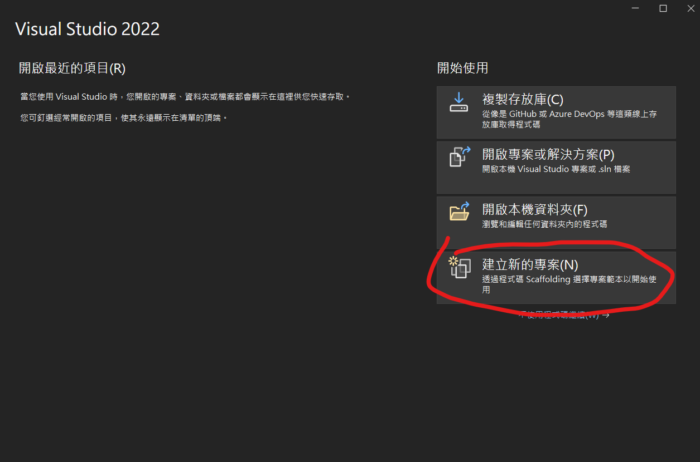
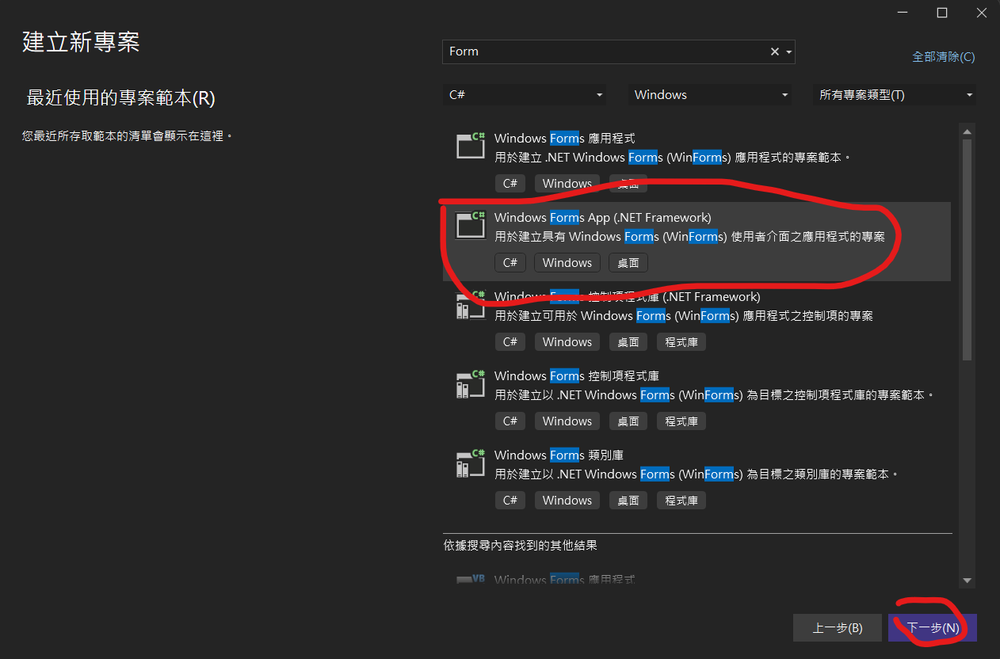
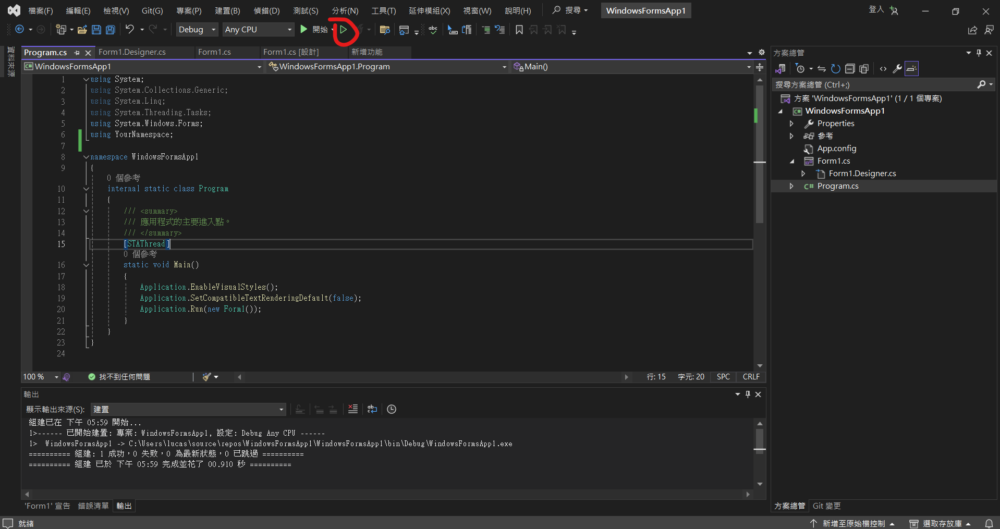
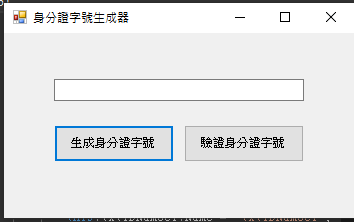
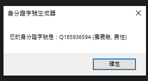
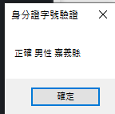
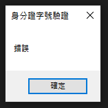

# 生成和驗證中華民國身分證字號
透過檢查碼原理驗證和生成身分證字號

## 如何使用
1.下載並安裝Visual Studio  [點我](https://visualstudio.microsoft.com/zh-hant/downloads/)

2.開啟Visual Studio(依照自身情況選擇登入或略過此步驟)

並且選擇啟動Visual Studio

3.選擇建立新專案

4.選擇Windows Forms App(.NET Framework)

5.將Form1.cs, Form1.Designer.cs, Program.cs的內容替換即可運行

## 操作畫面
有兩個按鈕**生成身份證字號**和**驗證身份證字號**

在輸入欄輸入身分證字號並點擊驗證就能驗證身分證字號

點擊生成身分證字號就會生成一段身分證字號

如果身份證字號驗證為真就會顯示性別和縣市

如果錯誤就會顯示錯誤

詳細的身分證字號規則可以看這篇文章 [點我](https://www.laws.taipei.gov.tw/lawatt/Law/A040070051029500-20081126-2000-012.pdf)